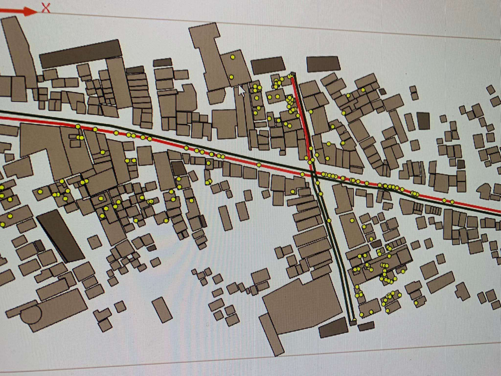

# 🚦 Traffic Flow Simulation using Agent-Based Modeling (GAMA)
(custom sample)
This project is a simulation of urban **traffic flow** developed in **GAMA Platform**, using **Agent-Based Modeling (ABM)** principles. The simulation models real-world behavior by defining key agents such as vehicles, roads, and traffic lights to observe how traffic patterns evolve over time under varying conditions.

---

## 🧠 Objective

To simulate and visualize how traffic congestion forms and changes depending on:

- 🚗 Vehicle density and movement
- ⏱ Traffic light timing
- 🛣️ Road layout and flow direction
- ⏳ Time of day (rush hour vs. normal)

This helps in analyzing how traffic lights and flow control affect congestion and travel time.

---

## 🔁 Simulation Overview

### 🔸 Agents:

| Agent        | Description                        |
|--------------|------------------------------------|
| **Vehicle**  | Moves along roads, waits at lights |
| **Road**     | Network graph for vehicle movement |
| **Traffic Light** | Controls flow at intersections |

### 🔸 Global Variables:

- `vehicle_count`: Number of vehicles in the simulation
- `light_timer`: Controls how long lights stay red/green
- `traffic_flow`: Measures vehicle movement rate
- `simulation_time`: Tracks time in hours/minutes
- `congestion_level`: Density of vehicles in key zones

---

## 🛠️ Built With

- **GAMA Platform** – Agent-based modeling environment  
  [Download GAMA](https://gama-platform.org/download)
- **GAML** – GAMA Modeling Language for agent behaviors and environment setup

---

## 🎮 Features

- Dynamic traffic light switching
- Varying vehicle spawn rates over time
- Real-time monitoring of traffic flow and congestion
- Visualization of gridlock and free-flow zones
- Adjustable parameters: traffic light timing, vehicle spawn rate, simulation speed

---

## 🧪 How to Run the Simulation

1. **Install GAMA Platform** (recommended version: 1.8+)
2. Open GAMA and import this project:
   - `File → Import Model From Folder`
3. Run the simulation:
   - Select `main.gaml`
   - Click **Run**
4. Adjust sliders for:
   - `vehicle_density`
   - `light_duration`
   - `simulation_speed`

---

## 📊 Metrics Tracked

- Average vehicle wait time
- Number of vehicles passing per minute
- Congestion level (vehicles per road segment)
- Total simulation duration

---

## 🧩 Sample Visualizations

## 📌 Use Cases

- Urban planning and smart city simulations
- Testing adaptive traffic control algorithms
- Educational demonstrations on ABM in traffic systems

---

## 📄 License

This project is for academic and demonstration purposes.  
© 2025 Joash. All rights reserved.

---

## 🙋‍♀️ Author

**Joash** – Student / Developer  
📫 Contact: arnelwowie@gmail.com

